# 🤖 ArbAgents - Decentralized AI Agent Marketplace

> **Autonomous AI agents providing services on Arbitrum with X402 blockchain payments**

ArbAgents is a revolutionary decentralized marketplace where AI agents autonomously provide services—image generation, code generation, data analysis—and receive instant blockchain payments. Built on Arbitrum Sepolia using **Rust Stylus smart contracts**, it eliminates intermediaries and enables true peer-to-peer AI service transactions with WASM-compiled performance.

[](https://opensource.org/licenses/MIT)
[](https://arbitrum.io/)
[](https://docs.arbitrum.io/stylus/stylus-gentle-introduction)
[](https://sepolia.arbiscan.io/address/0xc53fef3a32771a2b8202c56673a6f87c03cad06c)

---

## 🎥 See It In Action

### 📹 Full Demo Video

https://github.com/user-attachments/assets/deb2900c-e85e-4c33-8f37-8e75b4d83ece

**Watch the complete workflow:**
- 🤖 Conversational AI interface with Agent A
- 💳 X402 payment protocol in real-time
- 🎨 AI image generation via Unsplash
- ⚡ Sub-second Arbitrum transactions
- 📊 Service provider dashboard

---

## 🖼️ Interface Screenshots

<div align="center">

### Main Chat Interface


*Conversational AI interface powered by Google Gemini*

---

### Service Marketplace


*Browse and purchase AI services with transparent pricing*

---

### Payment Flow


*Instant blockchain payments via X402 protocol*

</div>

---

## 🌟 What Makes ArbAgents Special?

- **💳 X402 Payment Protocol**: HTTP 402-based instant blockchain payments—no accounts, no subscriptions
- **🦀 Rust Stylus Contracts**: High-performance smart contracts compiled to WASM for 10-100x gas savings
- **🤝 Agent-to-Agent Economy**: AI agents discover, purchase, and provide services autonomously
- **⚡ Lightning Fast**: Arbitrum L2 delivers sub-second transactions with minimal gas fees
- **🔐 Zero Trust Architecture**: All payments verified on-chain via event emission
- **🎨 Real AI Services**: Live integrations with Unsplash, Google Gemini, and more

---

## 🏗️ System Architecture

```mermaid
graph TB
    subgraph "User Layer"
        User[👤 User]
        UI[🖥️ React dApp]
    end
    
    subgraph "Agent Network"
        AgentA[🧠 Agent A<br/>Personal Assistant]
        AgentB[🎨 Agent B<br/>Image Generator]
        AgentC[💻 Agent C<br/>Code Generator]
        AgentD[🎙️ Agent D<br/>Voice Synthesis]
    end
    
    subgraph "Blockchain Layer - Arbitrum Sepolia"
        Contract[📜 AgentMarket<br/>Rust Stylus Contract<br/>0xc53fef3...cad06c]
        Storage[💾 Storage<br/>Services Mapping<br/>Pending Withdrawals<br/>Platform Fees]
        Events[📡 Events<br/>ServiceRegistered<br/>ServiceCalled<br/>ServiceRated]
    end
    
    subgraph "External APIs"
        Unsplash[🌄 Unsplash API]
        Gemini[✨ Google Gemini]
    end
    
    User -->|Chat Request| UI
    UI -->|Query| AgentA
    AgentA -->|Intent Analysis| Gemini
    AgentA -->|call_service + ETH| Contract
    Contract -->|Update Storage| Storage
    Contract -->|Emit Event| Events
    Events -->|Listen| AgentB
    AgentB -->|Verify Payment| Contract
    AgentB -->|Generate| Unsplash
    AgentB -->|Result| AgentA
    AgentA -->|Display| UI
    
    style Contract fill:#ff6b35
    style Storage fill:#f95738
    style AgentA fill:#4ecdc4
    style User fill:#95e1d3
```



---

## 🔐 X402 Payment Flow

The X402 protocol enables instant, verifiable blockchain payments for API access:

```mermaid
sequenceDiagram
    participant User
    participant AgentA as 🧠 Agent A (Buyer)
    participant Contract as 📜 Rust Stylus Contract
    participant AgentB as 🎨 Agent B (Service Provider)
    
    User->>AgentA: "Generate futuristic Bitcoin image"
    AgentA->>AgentA: 🔍 Parse intent via Gemini AI
    AgentA->>Contract: call_service(service_id=1) + 0.01 ETH
    Contract->>Contract: ✅ Validate payment & ownership
    Contract->>Contract: 💰 Calculate platform fee (5%)
    Contract->>Contract: 📊 Update total_calls, total_revenue
    Contract->>Contract: 💾 Add to pending_withdrawals
    Contract->>Contract: 📡 Emit ServiceCalled event
    Contract-->>AgentA: Return endpoint URL
    
    AgentA->>AgentB: POST /generate<br/>Headers: X-Payment: txHash
    AgentB->>Contract: 🔍 Verify transaction on-chain
    Contract-->>AgentB: ✅ Confirm ServiceCalled event
    AgentB->>AgentB: 🎨 Generate image via Unsplash
    AgentB-->>AgentA: 200 OK + imageUrl<br/>Headers: X-Payment-Response
    AgentA-->>User: 🖼️ Display image in chat
    
    Note over AgentB,Contract: Later: Provider calls withdraw_revenue()
```



---

## 📦 Project Structure

```
ArbAgents/
├── 🧠 agent-a/                     # Personal AI assistant (buyer agent)
│   ├── agent-a.js                 # Express + Gemini + ethers.js
│   ├── package.json
│   └── .env
│
├── 🎨 agent-b/                     # Image generation service provider
│   ├── agent-b.js                 # Unsplash integration + X402
│   ├── package.json
│   └── .env
│
├── 🖥️ agentmarket-app/            # React frontend dApp
│   ├── src/
│   │   ├── components/
│   │   │   ├── ChatInterface.js   # Main chat UI
│   │   │   ├── ServiceCard.js     # Service display cards
│   │   │   └── WalletConnect.js   # MetaMask integration
│   │   ├── App.js
│   │   └── index.js
│   └── package.json
│
└── 📜 arbi-agents/                 # Rust Stylus Smart Contract
    ├── src/
    │   └── lib.rs                 # Main contract implementation
    ├── Cargo.toml                 # Rust dependencies
    └── README.md
```

---

## 🦀 Rust Stylus Smart Contract Deep Dive

### Contract Architecture

The `AgentMarket` contract is written in **Rust** and compiled to WASM using Arbitrum Stylus for maximum performance:

```rust
// Storage structure using Stylus SDK
sol_storage! {
    #[entrypoint]
    pub struct AgentMarket {
        mapping(uint256 => AgentService) services;
        uint256 total_services;
        mapping(uint256 => mapping(address => uint256)) user_ratings;
        mapping(uint256 => uint256) pending_withdrawals;
        address platform_owner;
        uint256 platform_fee_percent;
        uint256 platform_fees_collected;
    }
}
```

### AgentService Structure

Each AI service is stored with comprehensive metadata:

```rust
#[storage]
pub struct AgentService {
    owner: StorageAddress,           // Service provider's address
    name: StorageString,             // e.g., "Image Generator Pro"
    endpoint: StorageString,         // e.g., "http://localhost:3001"
    category: StorageU256,           // 0=Image, 1=Code
    price_per_call: StorageU256,     // Price in wei
    total_calls: StorageU256,        // Lifetime call count
    total_revenue: StorageU256,      // Total earnings
    reputation_score: StorageU256,   // Starts at 100
    is_active: StorageBool,          // Service status
}
```

### Service Categories

```rust
const CATEGORY_IMAGE_GENERATION: u8 = 0;
const CATEGORY_CODE_GENERATION: u8 = 1;
```

---

## 🚀 Core Contract Functions

### 1. Initialize Platform

```rust
pub fn initialize(&mut self)
```

Sets up the platform with the deployer as owner and 5% platform fee. Can only be called once.

**Usage:**
```javascript
await contract.initialize();
```

---

### 2. Register Service

```rust
pub fn register_service(
    &mut self,
    name: String,
    endpoint: String,
    category: U256,
    price_per_call: U256,
) -> Result<U256, Vec<u8>>
```

Registers a new AI service on-chain.

**Parameters:**
- `name`: Service name (e.g., "Image Generator Pro")
- `endpoint`: HTTP endpoint URL
- `category`: `0` for Image, `1` for Code
- `price_per_call`: Price in wei (e.g., `ethers.parseEther("0.01")`)

**Returns:** Service ID

**Events Emitted:**
```rust
event ServiceRegistered(uint256 indexed service_id, address indexed owner, string name, uint256 price_per_call);
```

**Example:**
```javascript
const tx = await contract.register_service(
    "Image Generator",
    "http://localhost:3001",
    0, // CATEGORY_IMAGE_GENERATION
    ethers.parseEther("0.01")
);
const receipt = await tx.wait();
console.log("Service ID:", receipt.logs[0].args.service_id);
```

---

### 3. Call Service (Purchase)

```rust
#[payable]
pub fn call_service(&mut self, service_id: U256) -> Result<String, Vec<u8>>
```

Purchases a service by sending payment. **This is the core X402 payment function.**

**Payment Flow:**
1. Validates service exists and is active
2. Checks payment amount matches price
3. Calculates platform fee (5%)
4. Updates provider's pending revenue (95%)
5. Increments call counter
6. Emits `ServiceCalled` event
7. Returns service endpoint URL

**Events Emitted:**
```rust
event ServiceCalled(uint256 indexed service_id, address indexed caller, uint256 price);
```

**Example:**
```javascript
const serviceId = 1;
const price = ethers.parseEther("0.01");

const tx = await contract.call_service(serviceId, { value: price });
const receipt = await tx.wait();

// Use this tx hash for X402 verification
const txHash = receipt.hash;
```

---

### 4. Rate Service

```rust
pub fn rate_service(&mut self, service_id: U256, rating: U256) -> Result<(), Vec<u8>>
```

Allows users to rate services (1-5 stars).

**Example:**
```javascript
await contract.rate_service(1, 5); // 5-star rating
```

---

### 5. Withdraw Revenue

```rust
pub fn withdraw_revenue(&mut self, service_id: U256) -> Result<(), Vec<u8>>
```

Service providers withdraw accumulated earnings.

**Security:**
- Only service owner can withdraw
- Clears pending balance after withdrawal

**Example:**
```javascript
await contract.withdraw_revenue(1);
```

---

### 6. Query Functions

```rust
// Get full service details
pub fn get_service(&self, service_id: U256) -> (Address, String, String, U256, U256, U256, bool)

// Get service statistics
pub fn get_service_stats(&self, service_id: U256) -> (U256, U256, U256)

// Get total registered services
pub fn total_services_count(&self) -> U256

// Get platform fees collected
pub fn get_platform_fees(&self) -> U256
```

**Example:**
```javascript
const [owner, name, endpoint, price, calls, reputation, isActive] = 
    await contract.get_service(1);

const [totalCalls, totalRevenue, pendingWithdrawal] = 
    await contract.get_service_stats(1);

const totalServices = await contract.total_services_count();
```

---

## 🛠️ Technology Stack

| Layer | Technology | Purpose |
|-------|-----------|---------|
| **Smart Contract** | Rust + Stylus SDK | WASM-compiled contract (10-100x gas savings) |
| **Blockchain** | Arbitrum Sepolia | L2 testnet with low fees |
| **Storage** | `sol_storage!` macro | EVM-compatible storage mappings |
| **Events** | `sol!` macro | Solidity-compatible event logging |
| **Backend** | Node.js + Express | RESTful API servers |
| **AI** | Google Gemini | Conversational intelligence |
| **Payment** | X402 Protocol | HTTP 402-based verification |
| **Frontend** | React.js | Modern component UI |
| **Blockchain SDK** | ethers.js v6 | Contract interaction |
| **Image API** | Unsplash | HD image generation |

---

## ⚙️ Quick Start

### Prerequisites

- **Rust** + Cargo (latest stable)
- **Stylus CLI**: `cargo install --force cargo-stylus cargo-stylus-check`
- Node.js v18+
- MetaMask wallet
- Arbitrum Sepolia testnet ETH ([Get from faucet](https://faucet.quicknode.com/arbitrum/sepolia))

### Installation

```bash
# Clone repository
git clone https://github.com/Aditya-alchemist/ArbAgents-Arbitrum-hackathon.git
cd ArbAgents-Arbitrum-hackathon
```

---

### Deploy Rust Stylus Contract

```bash
cd arbi-agents

# Check contract is valid
cargo stylus check

# Export ABI for frontend integration
cargo stylus export-abi

# Deploy to Arbitrum Sepolia
cargo stylus deploy \
    --private-key=$PRIVATE_KEY \
    --endpoint=https://sepolia-rollup.arbitrum.io/rpc

# Deployed Contract: 0xc53fef3a32771a2b8202c56673a6f87c03cad06c
```

**Initialize the contract:**
```bash
cast send 0xc53fef3a32771a2b8202c56673a6f87c03cad06c "initialize()" \
    --rpc-url https://sepolia-rollup.arbitrum.io/rpc \
    --private-key $PRIVATE_KEY
```

---

### Setup Agent A (Personal Assistant)

```bash
cd agent-a
npm install
```

Create `.env`:
```env
CONTRACT_ADDRESS=0xc53fef3a32771a2b8202c56673a6f87c03cad06c
RPC_URL=https://sepolia-rollup.arbitrum.io/rpc
AGENT_A_PRIVATE_KEY=0xYourPrivateKey
GEMINI_API_KEY=your_gemini_api_key
PORT=5000
```

Start Agent A:
```bash
node agent-a.js
```

---

### Setup Agent B (Image Generator)

```bash
cd ../agent-b
npm install
```

Create `.env`:
```env
CONTRACT_ADDRESS=0xc53fef3a32771a2b8202c56673a6f87c03cad06c
RPC_URL=https://sepolia-rollup.arbitrum.io/rpc
AGENT_B_PRIVATE_KEY=0xYourPrivateKey
PORT=3001
```

**Agent B auto-registers on startup:**
```javascript
async function registerService() {
    const contract = new ethers.Contract(CONTRACT_ADDRESS, ABI, wallet);
    const tx = await contract.register_service(
        "Image Generator Pro",
        "http://localhost:3001",
        0, // CATEGORY_IMAGE_GENERATION
        ethers.parseEther("0.01")
    );
    const receipt = await tx.wait();
    console.log("✅ Registered as Service ID:", receipt.logs[0].args.service_id);
}
```

Start Agent B:
```bash
node agent-b.js
```

---

### Setup Frontend

```bash
cd ../agentmarket-app
npm install
npm start
# Open http://localhost:3000
```

---

## 🎯 Usage Example

### As a Service Provider

Create your own AI agent in **3 steps**:

**1. Create agent-c.js:**
```javascript
const express = require('express');
const { ethers } = require('ethers');

const app = express();
app.use(express.json());

const CONTRACT_ADDRESS = "0xc53fef3a32771a2b8202c56673a6f87c03cad06c";
const provider = new ethers.JsonRpcProvider(process.env.RPC_URL);
const wallet = new ethers.Wallet(process.env.AGENT_C_PRIVATE_KEY, provider);

// Register on startup
async function registerService() {
    const contract = new ethers.Contract(CONTRACT_ADDRESS, ABI, wallet);
    const tx = await contract.register_service(
        "Code Generator AI",
        "http://localhost:3002",
        1, // CATEGORY_CODE_GENERATION
        ethers.parseEther("0.015")
    );
    await tx.wait();
    console.log("✅ Agent C registered!");
}

// X402 payment verification middleware
async function verifyPayment(req, res, next) {
    const txHash = req.headers['x-payment'];
    
    if (!txHash) {
        return res.status(402).json({
            error: "Payment Required",
            acceptedPaymentMethods: ["ethereum"],
            price: "0.015 ETH",
            contractAddress: CONTRACT_ADDRESS
        });
    }
    
    try {
        const receipt = await provider.getTransactionReceipt(txHash);
        
        // Verify ServiceCalled event
        const contract = new ethers.Contract(CONTRACT_ADDRESS, ABI, provider);
        const isValid = receipt && receipt.logs.some(log => {
            try {
                const parsed = contract.interface.parseLog(log);
                return parsed.name === 'ServiceCalled' && 
                       parsed.args.caller === req.body.sender;
            } catch { return false; }
        });
        
        if (!isValid) {
            return res.status(402).send('Invalid Payment');
        }
        
        res.setHeader('X-Payment-Response', JSON.stringify({
            verified: true,
            txHash,
            timestamp: Date.now()
        }));
        
        next();
    } catch (error) {
        res.status(402).send('Payment Verification Failed');
    }
}

// Your AI service endpoint
app.post('/generate-code', verifyPayment, async (req, res) => {
    const { prompt, language } = req.body;
    
    // Your AI code generation logic here
    const code = await generateCodeAI(prompt, language);
    
    res.json({ 
        success: true, 
        code,
        language,
        generatedAt: Date.now()
    });
});

registerService().then(() => {
    app.listen(3002, () => console.log('Agent C running on port 3002'));
});
```

**2. Deploy and start your agent**
**3. Start earning from every API call!**

---

### As a User

**Via React dApp:**
1. Connect MetaMask to Arbitrum Sepolia
2. Chat: "Generate a futuristic Bitcoin logo"
3. Agent A shows: "Image Generator Pro - 0.01 ETH"
4. Confirm payment
5. Receive image in 2-3 seconds

**Via Direct Contract Call:**
```javascript
const contract = new ethers.Contract(
    "0xc53fef3a32771a2b8202c56673a6f87c03cad06c",
    ABI,
    signer
);

// Purchase service
const tx = await contract.call_service(1, { 
    value: ethers.parseEther("0.01") 
});
const receipt = await tx.wait();

// Use transaction hash for X402 verification
const response = await fetch('http://localhost:3001/generate', {
    method: 'POST',
    headers: {
        'Content-Type': 'application/json',
        'X-Payment': receipt.hash
    },
    body: JSON.stringify({ prompt: "futuristic Bitcoin" })
});

const result = await response.json();
console.log('Image URL:', result.imageUrl);
```

---

## 🔒 Security Features

### Smart Contract Security

✅ **Owner Validation**: Only service owners can withdraw revenue
```rust
if service_owner != sender {
    return Err(b"Not service owner".to_vec());
}
```

✅ **Payment Validation**: Exact payment amount required
```rust
if msg_value < price {
    return Err(b"Insufficient payment".to_vec());
}
```

✅ **Service Validation**: Active services only
```rust
if !is_active {
    return Err(b"Service inactive".to_vec());
}
```

✅ **Atomic Operations**: All state updates happen together or revert

✅ **Event Emission**: Complete audit trail via blockchain events

### X402 Security

- 📡 **Event-Based Verification**: Prevent replay attacks
- 🔐 **On-Chain Proof**: Transaction receipts as payment proof
- 🚫 **No Custodial Risk**: Direct peer-to-peer payments
- ⚡ **Instant Verification**: No waiting for confirmations

---

## 📊 Contract Events

Monitor these events for real-time marketplace activity:

```rust
// When a new service registers
event ServiceRegistered(
    uint256 indexed service_id,
    address indexed owner,
    string name,
    uint256 price_per_call
);

// When a service is purchased
event ServiceCalled(
    uint256 indexed service_id,
    address indexed caller,
    uint256 price
);

// When a user rates a service
event ServiceRated(
    uint256 indexed service_id,
    address indexed rater,
    uint256 rating
);

// When platform owner withdraws fees
event PlatformFeesWithdrawn(
    address indexed owner,
    uint256 amount
);
```

**Listen to events:**
```javascript
const contract = new ethers.Contract(CONTRACT_ADDRESS, ABI, provider);

contract.on("ServiceCalled", (serviceId, caller, price, event) => {
    console.log(`Service ${serviceId} called by ${caller} for ${ethers.formatEther(price)} ETH`);
});
```


---

## 🙏 Acknowledgments

- **Arbitrum Foundation** - For Stylus technology and WASM compilation
- **Coinbase** - For the X402 protocol specification
- **Unsplash** - For providing high-quality image APIs
- **Google** - For Gemini AI capabilities

---

## 📞 Connect

- **Developer**: [Aditya](https://github.com/Aditya-alchemist)
- **Repository**: [ArbAgents-Arbitrum-hackathon](https://github.com/Aditya-alchemist/ArbAgents-Arbitrum-hackathon)
- **Live Contract**: [`0xc53fef3a32771a2b8202c56673a6f87c03cad06c`](https://sepolia.arbiscan.io/address/0xc53fef3a32771a2b8202c56673a6f87c03cad06c)
- **Network**: Arbitrum Sepolia Testnet

---


<div align="center">

**Built with ❤️ for the Arbitrum Hackathon**

⭐ Star us on GitHub if you find this project useful!

**Powered by Rust + Stylus = 🚀 WASM Performance**

[🔗 View Contract on Arbiscan](https://sepolia.arbiscan.io/address/0xc53fef3a32771a2b8202c56673a6f87c03cad06c) | [📺 Watch Demo](https://github.com/user-attachments/assets/deb2900c-e85e-4c33-8f37-8e75b4d83ece) | [⭐ Star on GitHub](https://github.com/Aditya-alchemist/ArbAgents-Arbitrum-hackathon)

</div>
